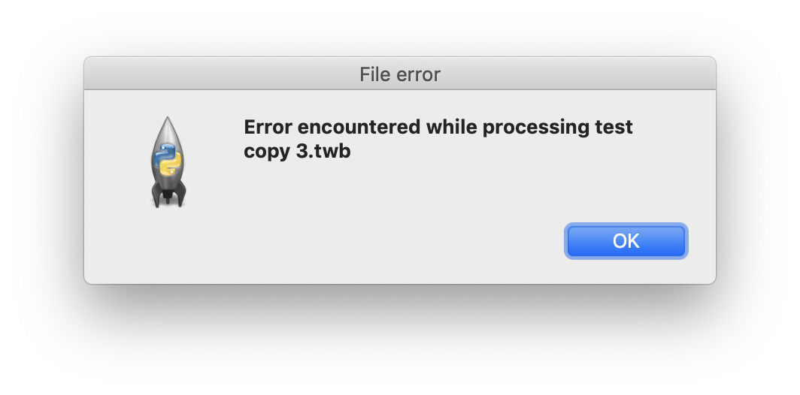
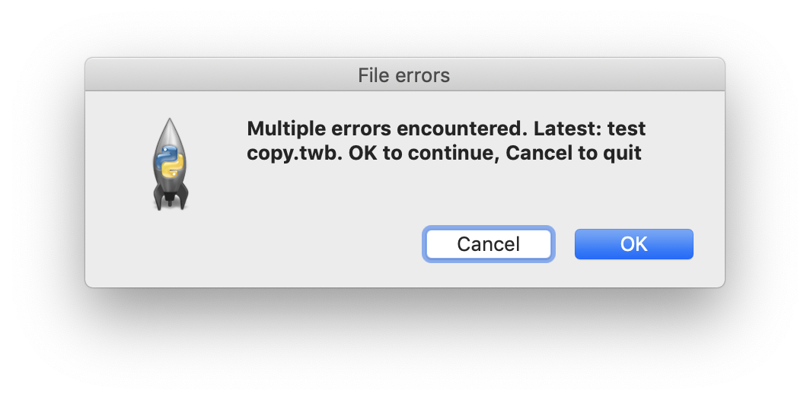
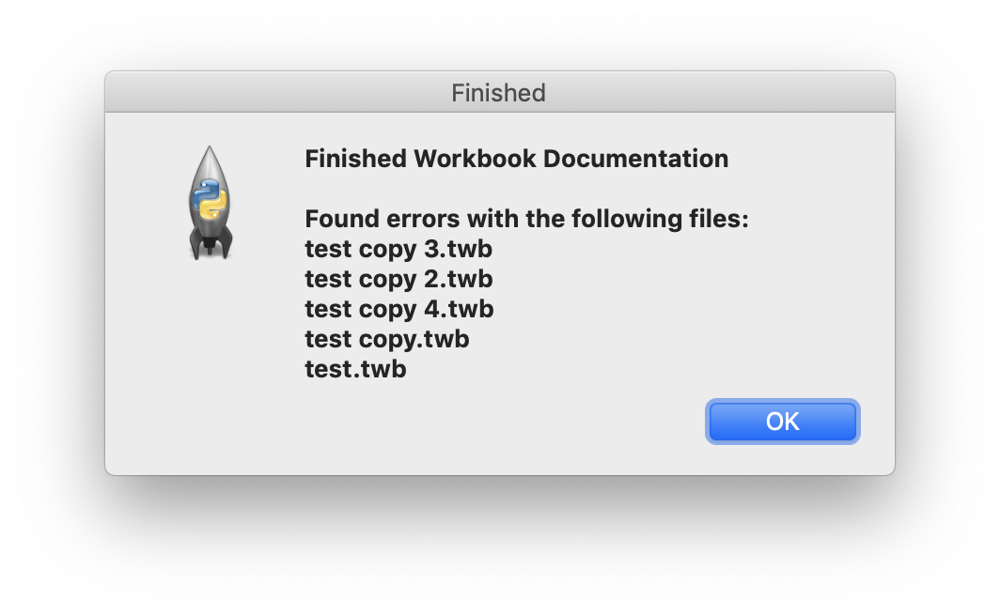

# TabDocs

Utility to extract data from Tableau Workbooks to automate the creation of workbook documentation

Use the GUI to set the input file or directory, and the output directory.

The program will create an Excel spreadsheet containing overall information about database tables, parameters, custom SQL, columns, calculations. It will also show which columns are used in each worksheet/visualization

## Interface

### Options:
* Scope to process: choose an individual file or directory to process
* File or Directory to process: path to content
  * Click browse to get a dialog to pick the content location
* Style Guide for Validation: path to style guide json
  * Click browse to get a dialog to pick the content location
  * Leave blank if you don't want to validate styles
* Save Directory: path where output will be saved
  * Click browse to get a dialog to pick the content location
* Start on open: set using commandline. When chosen, the processing will start immediately
* Hide Error Dialogs: set manually or using commandline. When chosen, no intermediate error dialogs will be shown. List of error files will still be included in the final dialog box
* OK: Click to start processing
* Quit: Click to close program

### Error reporting

* Shown for each individual file that produces a processing error

* Shown for every 3rd error
    * Click OK to continue processing
    * Click cancel to exit at that point
    

* Shown when processing is finished
    * The list of files that produced errors can be copied and pasted for follow up
    * Click OK to close
    
### Saved configuration

* Open: opens file picker to open an existing configuration file
* Save: opens save file dialog to set file name and destination path
* Quit: closes the program

### Commandline options

* --config \<path to config file> : include to automatically open an existing config file
* --autostart : set to start processing automatically on load. Will result in errors if a config file is not defined
* --noerrordialog : set to suppress the error dialogs. Final dialog box will still contain the list of files with errors 